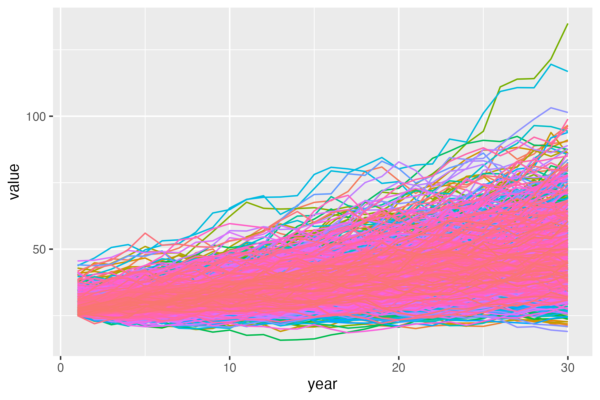
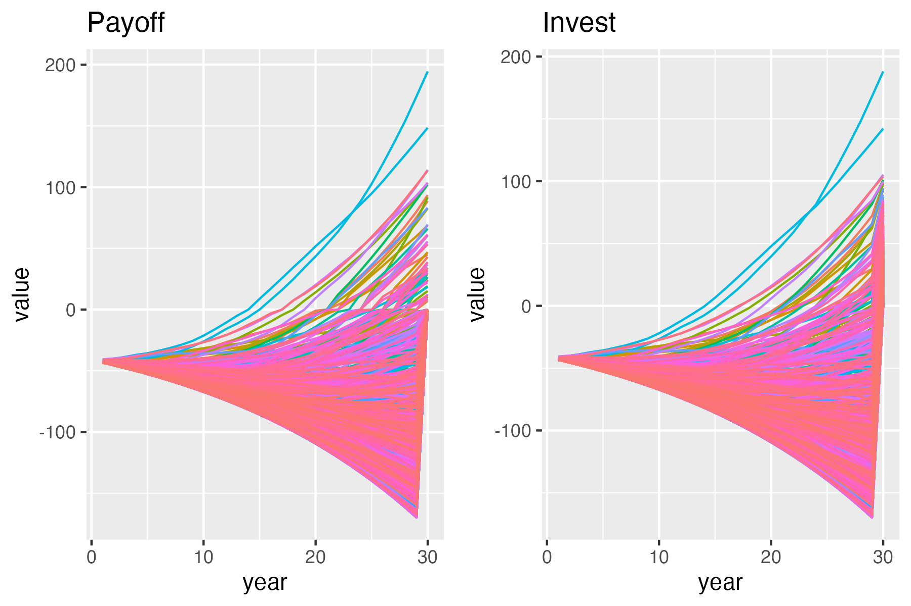
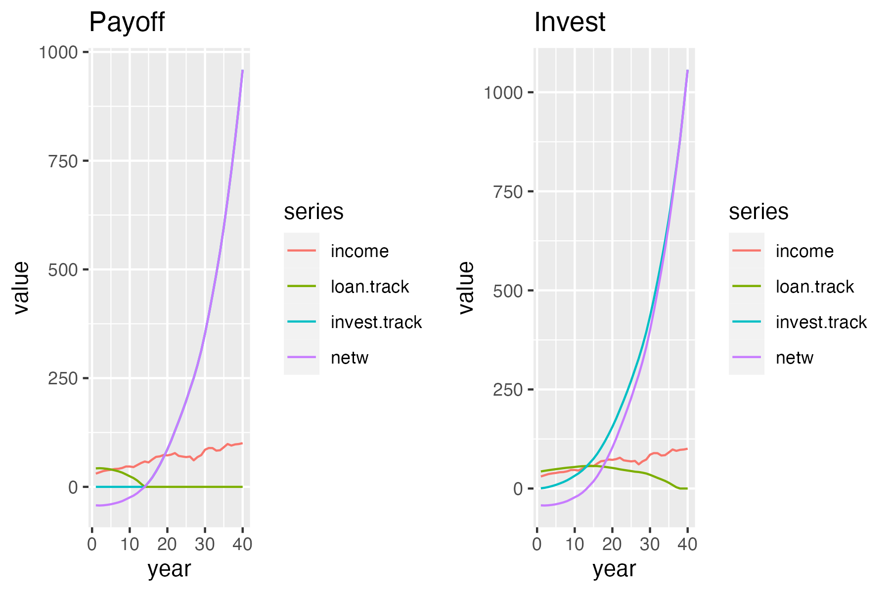

# Student-loan-model
Modelling impact of paying off student loan early vs investing disposable income

#Ensamble forecast of income distribution

#Ensamble view of two strategies

#Individual with starting salary of £30k and 3% mean income growth

